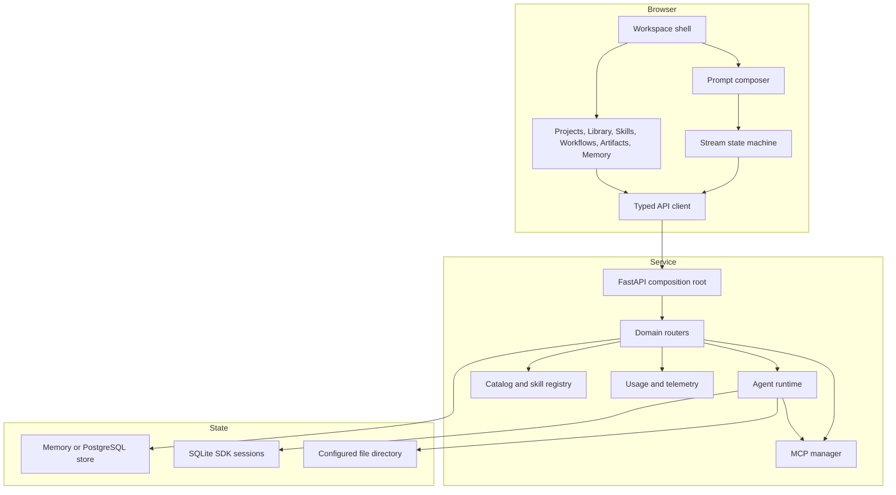
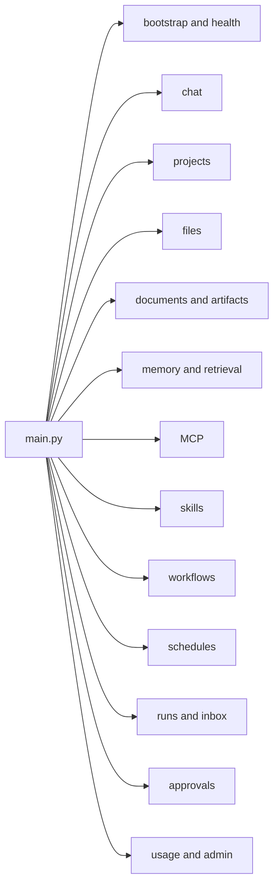
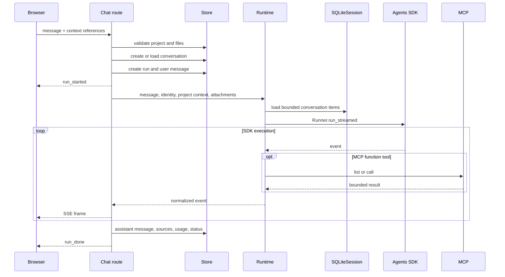
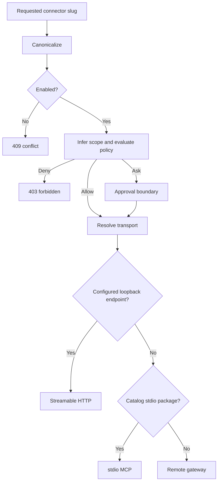
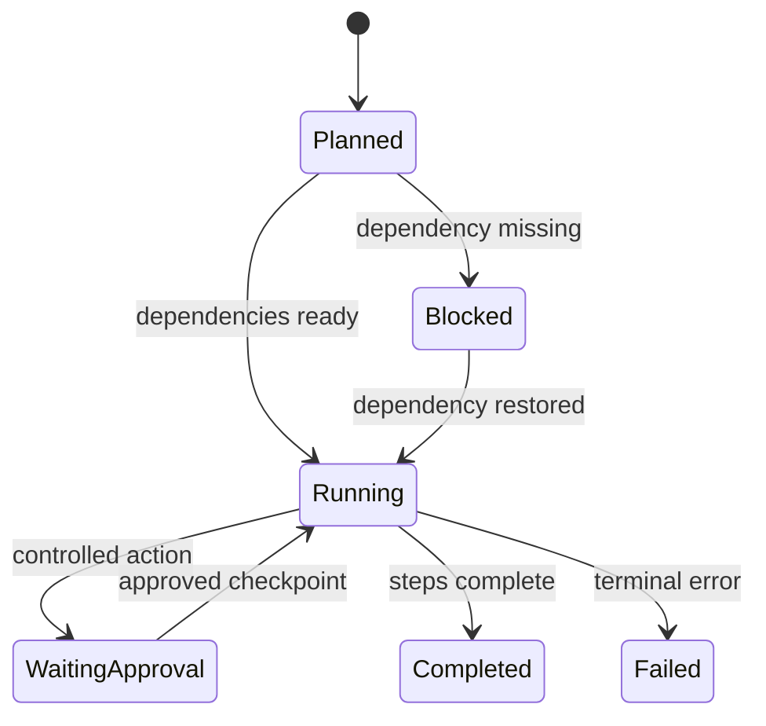
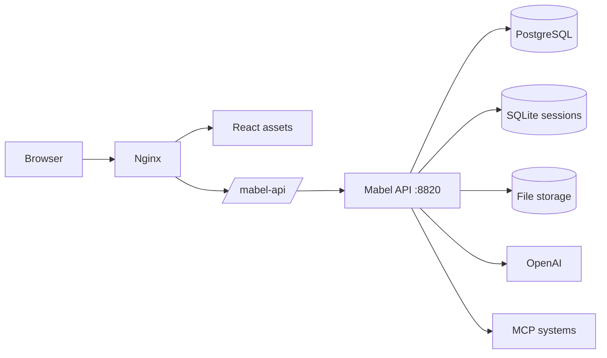

# Mabel architecture

## Design principles

Mabel follows five boundaries:

1. The model is an execution dependency, not the application database.
2. Retrieved content is data, not trusted instruction.
3. Connectors are discovered and invoked through explicit MCP contracts.
4. Durable work products outlive the chat turn that created them.
5. Environment and identity concerns stay outside product components.

## Component map



## Frontend

`apps/web/src/mabel/MabelPage.tsx` is the workspace composition root. It owns:

- selected surface
- conversation and project selection
- initial bootstrap snapshots
- context and artifact rails
- dialogs and settings
- optimistic conversation state
- the streamed-run integration

Feature pages are independent components mounted by the workspace view state.
The browser URL stores the active conversation or feature surface, allowing
refresh and deep-link restoration.

`apps/web/src/mabel/api.ts` owns:

- same-origin URL construction
- JSON requests
- multipart uploads
- file fetches
- SSE decoding
- workflow and run control
- domain CRUD

`apps/web/src/mabel/hooks/useMabelStream.ts` converts stream events into
optimistic messages, assistant tokens, tool activity, sources, files, artifacts,
and terminal state.

## API composition

`apps/api/mabel_api/main.py` creates the FastAPI application and includes domain
routers:



Routes resolve identity, validate ownership, call domain/store operations, and
serialize the result. The application store interface allows memory and
PostgreSQL implementations to support the same route contract.

## Agent turn



### Failure boundaries

- Validation before streaming can return a normal 4xx response.
- Failures after the SSE response begins are emitted as `error` events.
- Provider readiness notices can be persisted as completed text responses.
- Local file upload can succeed when optional provider-file mirroring fails.
- Connector transport failures are returned as gateway errors.

## Native runtime tools

The agent runtime exposes Mabel-owned tools for:

- memory search and save
- workspace context
- starter-pack retrieval
- skill search, retrieval, and creation
- execution-plan construction
- workflow creation
- artifact persistence
- scheduled-task creation
- start-of-day briefing
- MCP tool discovery and invocation

Hosted tools are added only when supported by the installed SDK and enabled by
configuration.

## Connector resolution



Local endpoint URLs are limited to loopback hosts. Remote tools require explicit
gateway configuration and credentials.

## Skills

A skill package consists of:

```text
packages/skills/<slug>/
├── manifest.json
└── SKILL.md
```

The manifest defines identity, version, lifecycle, ownership, tags, entrypoint,
and connector dependencies. The instruction file contains the operating method.

Skills can also be created in the application store or synchronized from a
configured GitHub repository.

## Workflows

Workflow metadata combines:

- objective
- role
- commands
- skill IDs
- connector slugs
- policies
- schedule metadata

The current workflow path creates an execution plan, checkpoints, step results,
next actions, and observability events. Mutating objectives can enter a waiting
approval state.



## Persistence

### Application store

Memory mode supports fast local development and isolated tests. PostgreSQL mode
stores durable domain objects and normalized operational rows.

Principal PostgreSQL tables include:

- projects
- conversations
- messages
- tool calls
- runs
- approvals
- connectors
- skills
- documents
- memory items
- usage events
- prompt inbox
- compatibility state

### Agent sessions

The OpenAI Agents SDK `SQLiteSession` stores model-visible conversation items
under a conversation-derived session key. It is intentionally separate from
Mabel's user-facing message history.

### Files

File metadata belongs to the application store. Bytes belong to the configured
file directory. Provider-file mirroring is optional and best effort.

## Deployment



The included container topology is a single-node development and evaluation
shape. A production topology should replace:

- local files with object storage
- local SQLite sessions with shared session state
- unclaimed schedules with durable queue leases
- compatibility-state writes with transactional normalized repositories
- development identity with verified OIDC or identity-aware edge claims

## Scale and reliability roadmap

1. Versioned database migrations.
2. Fully transactional normalized repositories.
3. Object storage and malware scanning.
4. Shared agent sessions.
5. Durable queue, leases, retries, and idempotency.
6. Unified policy and approval state machine.
7. Tenant-scoped rows, caches, connectors, and encryption.
8. Retention and deletion orchestration.
9. OpenTelemetry traces and redacted audit export.
10. Outcome evaluation per skill and workflow.
